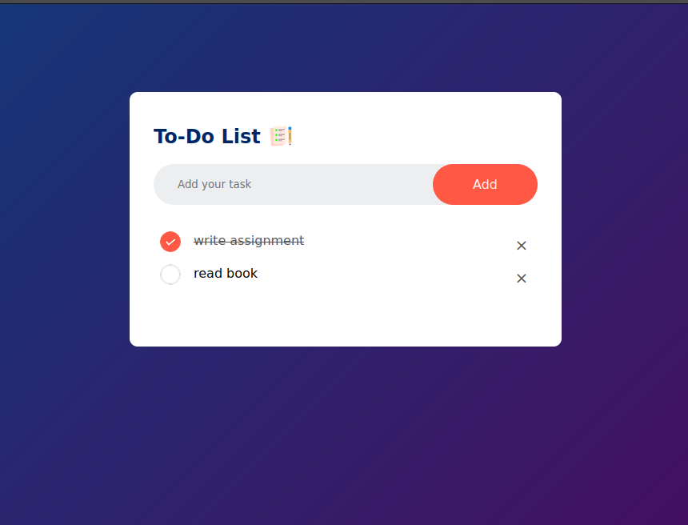

# Simple Weather App

A simple weather web application built using **HTML**, **CSS**, and **JavaScript**, allowing users to search for real-time weather data by city name. It fetches weather information from the [OpenWeatherMap API](https://openweathermap.org/api) and displays temperature, humidity, and wind speed with dynamic icons.




## Features

- Search weather by city name
- Displays:
  - Current temperature in Celsius
  - City name
  - Humidity
  - Wind speed
  - Dynamic weather icon (Clouds, Clear, Rain, Drizzle, Mist)
- Handles errors such as invalid city names and API key issues

## Demo

To see the app in action, open `index.html` in a browser after setting your API key.

## Setup

1. Clone the repository:
   ```bash
   git clone https://github.com/your-username/weather-app.git
   cd weather-app
   ```

2. Get your API key from [OpenWeatherMap](https://openweathermap.org/api).

3. Open the `index.html` file and paste your API key:
   ```javascript
   const apiKey = "YOUR_API_KEY_HERE";
   ```

4. Open `index.html` in your browser.

## File Structure

```
weather-app/
├── images/
│   ├── clear.png
│   ├── clouds.png
│   ├── drizzle.png
│   ├── humidity.png
│   ├── mist.png
│   ├── rain.png
│   ├── search.png
│   └── wind.png
├── style.css
├── index.html
└── README.md
```

## Technologies Used

- HTML5
- CSS3
- JavaScript (ES6+)
- OpenWeatherMap API

## Notes

- This app only uses client-side JavaScript. For security, avoid pushing your real API key to a public repository.
- API key errors (e.g., invalid or missing key) are handled with visible error messages.

## License

This project is open-source and available under the [MIT License](LICENSE).

## Reference
- The reference of the project: [How To Make Weather App Using JavaScript Step By Step Explained by GreatStack](https://www.youtube.com/watch?v=MIYQR-Ybrn4)

---

Feel free to contribute by submitting issues or pull requests!

